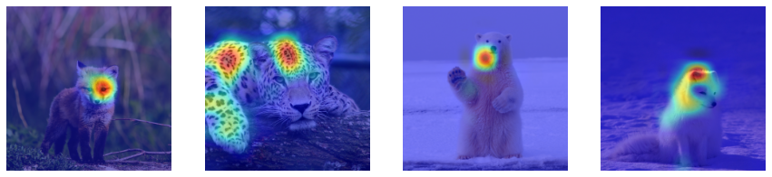

# Sobol Attribution Method (NeurIPS 2021)

This repository contains code for the paper:
**Look at the Variance! Efficient Black-box Explanations with Sobol-based Sensitivity Analysis**, Thomas Fel*, Rémi Cadène*, Mathieu Chalvidal, Matthieu Cord, David Vigouroux & Thomas Serre. NeurIPS 2021, [[arXiv]](https://arxiv.org/abs/2111.04138).

The code is implemented and available **for Pytorch & Tensorflow**. A notebook for each of them is available: [notebook Pytorch](./pytorch_example.ipynb), [notebook Tensorflow](./tensorflow_example.ipynb).




```
@inproceedings{fel2021sobol,
      title={Look at the Variance! Efficient Black-box Explanations with Sobol-based Sensitivity Analysis}, 
      author={Thomas Fel and Remi Cadene and Mathieu Chalvidal and Matthieu Cord and David Vigouroux and Thomas Serre},
      year={2021},
      booktitle={Advances in Neural Information Processing Systems (NeurIPS)}
}
```
